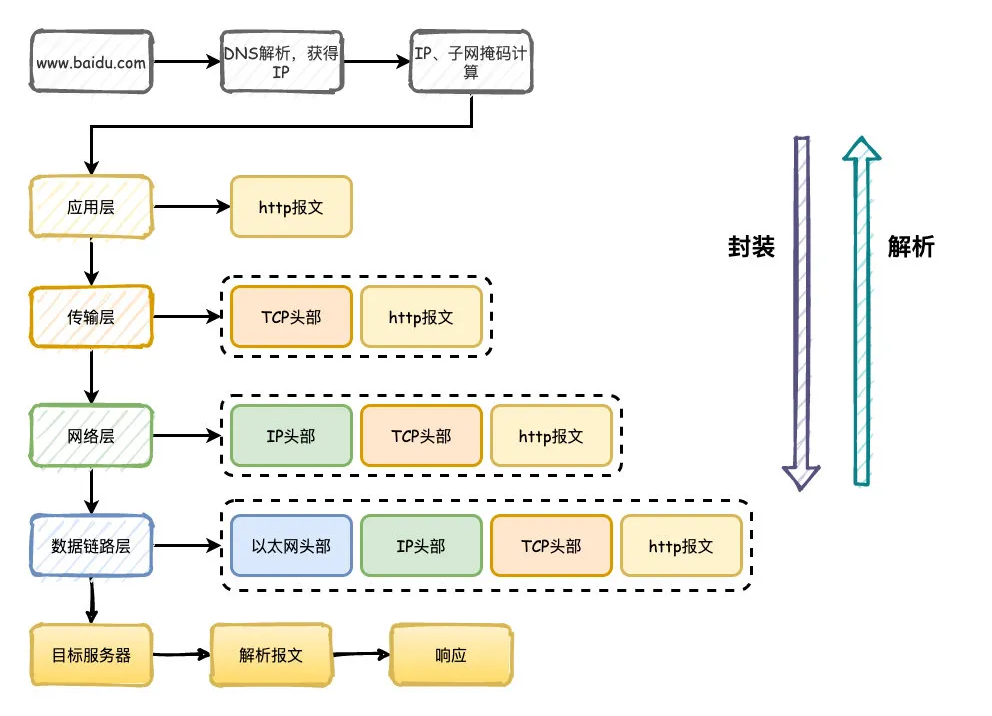
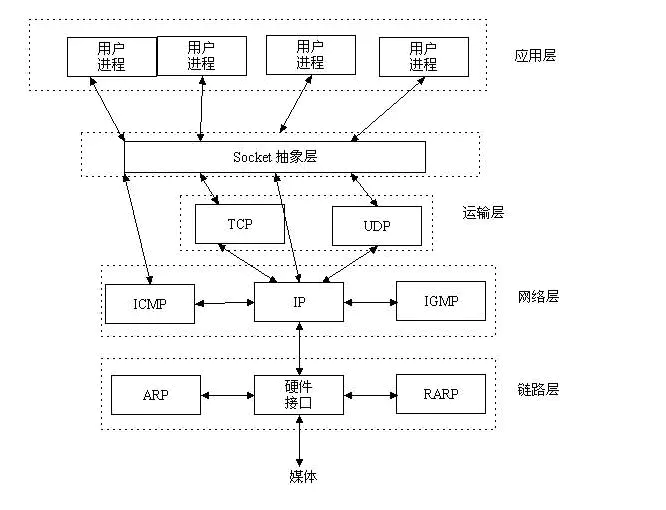

<!--
 * @Author: your name
 * @Date: 2021-04-08 21:36:57
 * @LastEditTime: 2021-04-08 22:02:17
 * @LastEditors: Please set LastEditors
 * @Description: In User Settings Edit
-->
<!-- TOC -->

- [1. 链路层的ARP协议](#1-链路层的arp协议)
- [2. 关闭client端，服务器端如何处理？](#2-关闭client端服务器端如何处理)
- [3. 场景题，输入www.baidu.com后，如何得到返回界面的？](#3-场景题输入wwwbaiducom后如何得到返回界面的)
- [4. epoll，select实现的功能，聊一聊多路复用的理解；](#4-epollselect实现的功能聊一聊多路复用的理解)
- [5. epol的et lt（讲了点epoll_wait处理方式的区别，提了下缓冲区水位）epoll边沿触发和水平触发？](#5-epol的et-lt讲了点epoll_wait处理方式的区别提了下缓冲区水位epoll边沿触发和水平触发)
- [6. 惊群问题怎么解决 （epoll里面自带的什么参数或者宏能）](#6-惊群问题怎么解决-epoll里面自带的什么参数或者宏能)
- [7. tcp四次挥手，time_wait状态](#7-tcp四次挥手time_wait状态)
- [8. 四种定时器](#8-四种定时器)
- [9. arp协议，协议作用在那一层](#9-arp协议协议作用在那一层)
- [10. TCP如何保证可靠性传输？](#10-tcp如何保证可靠性传输)
- [11. TCP的四个定时器？](#11-tcp的四个定时器)
- [12. TCP粘包问题？](#12-tcp粘包问题)
- [13. epoll和select的区别？](#13-epoll和select的区别)
- [14. Listen accept bind调用时，内核层面发生了什么？](#14-listen-accept-bind调用时内核层面发生了什么)
- [15. TCP和UDP有什么区别？](#15-tcp和udp有什么区别)
- [16. TIME_WAIT的两个作用？](#16-time_wait的两个作用)
- [17. TIME_WAIT和CLOSE_WAIT的区别？](#17-time_wait和close_wait的区别)
- [18. ARP是什么？协议是怎么实现的？](#18-arp是什么协议是怎么实现的)
- [19. ARP是怎么找到MAC地址的？](#19-arp是怎么找到mac地址的)
- [20. 建立网络链接时，客户端和服务器的过程？](#20-建立网络链接时客户端和服务器的过程)
- [21. 发送数据时阻塞和非阻塞的区别？](#21-发送数据时阻塞和非阻塞的区别)
- [22. recv调用成功是已经正确收到数据了吗？](#22-recv调用成功是已经正确收到数据了吗)
- [23. 简单说一下TCP的三次握手，并说说三次握手做了什么事情，每次通讯包发了什么](#23-简单说一下tcp的三次握手并说说三次握手做了什么事情每次通讯包发了什么)
- [24. 讲一下TCP与UDP的差异，优缺点。](#24-讲一下tcp与udp的差异优缺点)
- [25. 什么时候应该使用TCP](#25-什么时候应该使用tcp)
- [26. 什么时候应该使用UDP](#26-什么时候应该使用udp)
- [27. tcp三次握手和四次挥手说一下，他们的当时状态分别是怎么样的？](#27-tcp三次握手和四次挥手说一下他们的当时状态分别是怎么样的)
- [28. 说说http协议有哪些常见状态码，403代表什么意思？](#28-说说http协议有哪些常见状态码403代表什么意思)
- [29. 知道HTTPS的工作原理吗？](#29-知道https的工作原理吗)
- [30. 对于拥塞控制，你给我做一下介绍吧](#30-对于拥塞控制你给我做一下介绍吧)
- [31. socket与UDP的区别？](#31-socket与udp的区别)

<!-- /TOC -->
# 1. 链路层的ARP协议

# 2. 关闭client端，服务器端如何处理？

# 3. 场景题，输入www.baidu.com后，如何得到返回界面的？
1. 首先通过DNS服务器把域名解析成IP地址，通过IP和子网掩码判断是否属于同一个子网
2. 构造应用层请求http报文，传输层添加TCP/UDP头部，网络层添加IP头部，数据链路层添加以太网协议头部
3. 数据经过路由器、交换机转发，最终达到目标服务器，目标服务器同样解析数据，最终拿到http报文，按照对应的程序的逻辑响应回去。

# 4. epoll，select实现的功能，聊一聊多路复用的理解；

# 5. epol的et lt（讲了点epoll_wait处理方式的区别，提了下缓冲区水位）epoll边沿触发和水平触发？

# 6. 惊群问题怎么解决 （epoll里面自带的什么参数或者宏能）

# 7. tcp四次挥手，time_wait状态

# 8. 四种定时器

# 9. arp协议，协议作用在那一层

# 10. TCP如何保证可靠性传输？
超时重传、确认机制、流量控制（滑动窗口协议）、按序重排、拥塞控制。

# 11. TCP的四个定时器？

# 12. TCP粘包问题？

# 13. epoll和select的区别？

# 14. Listen accept bind调用时，内核层面发生了什么？
Linux给socket套接字在内核里面分配了两个缓冲区，分别为read缓冲区和write缓冲区，通过文件描述符的指向来实现不同的传输。

# 15. TCP和UDP有什么区别？

# 16. TIME_WAIT的两个作用？

# 17. TIME_WAIT和CLOSE_WAIT的区别？

# 18. ARP是什么？协议是怎么实现的？

# 19. ARP是怎么找到MAC地址的？

# 20. 建立网络链接时，客户端和服务器的过程？

# 21. 发送数据时阻塞和非阻塞的区别？

# 22. recv调用成功是已经正确收到数据了吗？

# 23. 简单说一下TCP的三次握手，并说说三次握手做了什么事情，每次通讯包发了什么

# 24. 讲一下TCP与UDP的差异，优缺点。
TCP的优点：
	• 可靠，稳定
TCP的可靠体现在TCP在传递数据之前，会有三次握手来建立连接，而且在数据传递时，有确认、窗口、重传、拥塞控制机制，在数据传完后，还会断开连接用来节约系统资源。
TCP的缺点：
	• 慢，效率低，占用系统资源高，易被攻击
TCP在传递数据之前，要先建连接，这会消耗时间，而且在数据传递时，确认机制、重传机制、拥塞控制机制等都会消耗大量的时间，而且要在每台设备上维护所有的传输连接，事实上，每个连接都会占用系统的CPU、内存等硬件资源。
而且，因为TCP有确认机制、三次握手机制，这些也导致TCP容易被人利用，实现DOS、DDOS、CC等攻击。
UDP的优点：
	• 快，比TCP稍安全
UDP没有TCP的握手、确认、窗口、重传、拥塞控制等机制，UDP是一个无状态的传输协议，所以它在传递数据时非常快。没有TCP的这些机制，UDP较TCP被攻击者利用的漏洞就要少一些。但UDP也是无法避免攻击的，比如：UDP Flood攻击……
UDP的缺点：
	• 不可靠，不稳定
因为UDP没有TCP那些可靠的机制，在数据传递时，如果网络质量不好，就会很容易丢包。

# 25. 什么时候应该使用TCP
当对网络通讯质量有要求的时候，比如：整个数据要准确无误的传递给对方，这往往用于一些要求可靠的应用，比如HTTP、HTTPS、FTP等传输文件的协议，POP、SMTP等邮件传输的协议。
在日常生活中，常见使用TCP协议的应用如下：
	• 浏览器，用的HTTP
	• FlashFXP，用的FTP
	• Outlook，用的POP、SMTP
	• Putty，用的Telnet、SSH
	• QQ文件传输
		

# 26. 什么时候应该使用UDP
当对网络通讯质量要求不高的时候，要求网络通讯速度能尽量的快，这时就可以使用UDP。
比如，日常生活中，常见使用UDP协议的应用如下：
QQ 语音，QQ 视频，TFTP 
总结：
	1、TCP 面向连接（如打电话要先拨号建立连接）; UDP 是无连接的，即发送数据之前不需要建立连接。
	2、TCP 提供可靠的服务。也就是说，通过 TCP 连接传送的数据，无差错，不丢失，不重复，且按序到达；UDP 尽最大努力交付，即不保证可靠交付。
	3、TCP 面向字节流，实际上是 TCP 把数据看成一连串无结构的字节流；UDP 是面向报文的。UDP 没有拥塞控制，因此网络出现拥塞不会使源主机的发送速率降低（对实时应用很有用，如IP电话，实时视频会议等）
	4、每一条 TCP 连接只能是点到点的；UDP支持一对一，一对多，多对一和多对多的交互通信。
	5、TCP 首部开销 20 字节；UDP 的首部开销小，只有 8 个字节。
	6、TCP 的逻辑通信信道是全双工的可靠信道，UDP 则是不可靠信道。

# 27. tcp三次握手和四次挥手说一下，他们的当时状态分别是怎么样的？

# 28. 说说http协议有哪些常见状态码，403代表什么意思？
2XX 成功
· 200 OK，表示从客户端发来的请求在服务器端被正确处理
· 204 No content，表示请求成功，但响应报文不含实体的主体部分
· 206 Partial Content，进行范围请求

3XX 重定向
· 301 moved permanently，永久性重定向，表示资源已被分配了新的 URL
· 302 found，临时性重定向，表示资源临时被分配了新的 URL
· 303 see other，表示资源存在着另一个 URL，应使用 GET 方法丁香获取资源
· 304 not modified，表示服务器允许访问资源，但因发生请求未满足条件的情况
· 307 temporary redirect，临时重定向，和302含义相同

4XX 客户端错误
· 400 bad request，请求报文存在语法错误
· 401 unauthorized，表示发送的请求需要有通过 HTTP 认证的认证信息
· 403 forbidden，表示对请求资源的访问被服务器拒绝
· 404 not found，表示在服务器上没有找到请求的资源

5XX 服务器错误
· 500 internal sever error，表示服务器端在执行请求时发生了错误
· 503 service unavailable，表明服务器暂时处于超负载或正在停机维护，无法处理请求

来自 <https://blog.csdn.net/liouswll/article/details/80698619> 
	

# 29. 知道HTTPS的工作原理吗？
1. 用户通过浏览器请求https网站，服务器收到请求，选择浏览器支持的加密和hash算法，同时返回数字证书给浏览器，包含颁发机构、网址、公钥、证书有效期等信息。
2. 浏览器对证书的内容进行校验，如果有问题，则会有一个提示警告。否则，就生成一个随机数X，同时使用证书中的公钥进行加密，并且发送给服务器。
3. 服务器收到之后，使用私钥解密，得到随机数X，然后使用X对网页内容进行加密，返回给浏览器
4. 浏览器则使用X和之前约定的加密算法进行解密，得到最终的网页内容

# 30. 对于拥塞控制，你给我做一下介绍吧

# 31. socket与UDP的区别？
Socket是应用层与网络层中TCP/IP协议族通信的一个中间软件抽象层，它是一组接口。它把复杂的TCP/IP协议族隐藏在Socket接口后面，让Socket去组织数据，以符合指定的协议。Socket是对TCP/IP协议的封装，Socket本身并不是协议，而是一个调用接口（API），通过Socket，我们才能使用TCP/IP协议。

实际上，Socket跟TCP/IP协议没有必然的联系。Socket编程接口在设计的时候，就希望也能适应其他的网络协议。所以说，Socket的出现只是使得程序员更方便地使用TCP/IP协议栈而已，是对TCP/IP协议的抽象，从而形成了我们知道的一些最基本的函数接口，比如create、 listen、connect、accept、send、read和write等等。

> TCP和UDP：传输层协议；
> HTTP：应用层协议；
> SOCKET：TCP/IP网络的API。
> TCP/IP代表传输控制协议/网际协议，指的是一系列协议。

